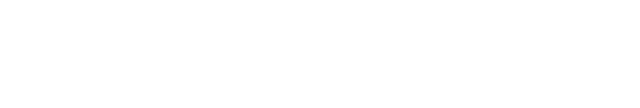

# Imaging to Bits
A small command-line program I wrote to inline text bitmap into another project. It uses the ubiquitous STB image library to load an image and will then create a .txt called array.txt containing the image's alpha, either in bits (default) or bytes (if specified).

PLEASE NOTE that I was too lazy to remove the last comma from array.txt in code, figuring it is far easier to do manually from a text editor or your IDE.

If you use default settings, alpha will be either 1 or 0, giving the resulting image a pixelated appearance (but also shrinking the image to 8 pixels per byte). If you want a smoother appearance, i.e. wanting more rounded glyphs, save the alpha in bytes instead. Please remember that if you save alpha in bits, you will have to unpack the data in your project (code example provided below).

Speaking of code, this is a very short program that really only does one thing so I put all of it into the main function. It isnt't exactly OOP but it is a lot easier to read this way, especially considering it is only a few if-statements. I didn't bother commenting or making it pretty. Instead, this is an example of how I write to put something quickly into working order. The option to save each pixel's alpha in bytes was added later since I wanted more rounded fonts for another project, which is why it may appear more or less bolted onto the existing code.

## Example case
Using a monospaced font is highly recommended for ease of integration into your project. I picked Cascadia and made a .png with GIMP



in ASCII-order (definitely recommended). Although it is simpler to have all glyphs in one line instead of three, I wanted to stress-test my setup to make sure it was robust. To see the result of Cascadia and scrutinize the code using the array, have a look at Mesh2Image [github.com/B0realian/MeshToImage/](https://github.com/B0realian/MeshToImage).
To see what the resulting array.txt looks like for the image above, look at cascadia-array.txt in the root of this repo. Incidentally, I save the alpha as represented by bits in a separate .txt for debugging purposes, which you can see in bytes_blueprint.txt.

## Usage
From the command line: imagingbits your_image.png -f whatever
Where the image has to be your first argument.
Having only one argument runs the program with default settings (representing each pixel's alpha as a bit and NOT flipping the image).
A second argument can be either -f or anything else where -f will flip the image vertically on load and anything else will save each pixel's alpha as a byte.
Using three or more arguments will, regardless of what they are, both flip the image and save alpha as a byte per pixel.

## Unpacking your bits
The exact code is available in Mesh2Image (specifically in TextMap.cpp). Essentially, you want to create/reserve an array of bytes (called textdata in my example) that is 32 times larger than your array.txt (that you have inlined and named something intelligent, in my case cascadiadata) and set every first 3 of 4 bytes to 255 (making the whole image white) while the 4th byte is 255 * the bit value:

```cpp
uint8_t* textdata = new uint8_t[cascadia_elements * 8 * 4];

uint8_t* CascadiaData()
{
	for (int32_t i = 0; i < cascadia_elements; i++)
	{
		for (int32_t a = 0; a < 8; a++)
		{
			for (int32_t rgb = 0; rgb < 3; rgb++)
				textdata[(i * 32) + (a * 4) + rgb] = 255;

			uint8_t value = cascadiadata[i] << a;
			textdata[(i * 32) + (a * 4) + 3] = 255 * (value >> 7);
		}
	}

	return &textdata[0];
}
```

As you can see from the bit-shifts, each byte is iterated over 8 times and shifted once more to the left each time. The resulting value is then bit-shifted all the way to the right, giving us only the single bit's value of 1 or 0. You now have the entire image entirely white but transparent where there are no letters. All that remains is to map the image's uv to each char it represents:

```cpp
// Note that this struct is defined in a different header but included here for illustrative purposes
struct BMuv
{
  glm::vec2 topLeftUV;
  glm::vec2 topRightUV;
  glm::vec2 bottomLeftUV;
  glm::vec2 bottomRightUV;
};

void GetCascadiaMap(std::map<char, BMuv> &bmuv)
{
	bmuv.clear();
	int asciiValue = 32;
	int tableWidth = 32;
	int tableHeight = 3;
	for (int i = 0; i < 3; i++)
	{
		for (int j = 0; j < 32; j++)
		{
			char c = char(asciiValue);
			BMuv tempbmuv;
			tempbmuv.topLeftUV = { static_cast<float>(j) / tableWidth , static_cast<float>(i) / tableHeight };
			tempbmuv.topRightUV = { static_cast<float>(j + 1) / tableWidth , static_cast<float>(i) / tableHeight };
			tempbmuv.bottomLeftUV = { static_cast<float>(j) / tableWidth , static_cast<float>(i + 1) / tableHeight };
			tempbmuv.bottomRightUV = { static_cast<float>(j + 1) / tableWidth , static_cast<float>(i + 1) / tableHeight };

			bmuv.insert({ c, tempbmuv });
			
			asciiValue++;
		}
	}
	std::cout << "TextMap Generated!" << std::endl;
}
```

As you can see, I hardcoded the width and height (in glyphs) of the image, knowing that I would only use that particular font in the project. Also, this is where it is handy to have the glyphs in the image in ascii-order since you can simply iterate through them. If you want to extend your font to include the remaining glyphs you can either leave empty spaces in the image for the unprintable characters or make another for-loop for the next set of printable characters.

Actually getting the text onto your screen will differ depending on your framework. Essentially, you put the string or char* into a function along with its map (and colour, since you want your text to be fancy) where you iterate through each char's int-value to map the correct uv onto a new quad. You're making vertice-arrays on the fly. This example is using OpenGL (with GLEW):

```cpp
void UIText::WriteLine(const char* text, const std::map<char, BMuv> &textmap, const ETextColour in_colour)
{
	glm::vec3 colour;
	switch (in_colour)
	{
	case ETextColour::None:
	case ETextColour::WHITE:
		colour = glm::vec3{ 1.f, 1.f, 1.f };
		break;
	case ETextColour::RED:
		colour = glm::vec3{ 1.f, 0.f, 0.f };
		break;
	case ETextColour::GREEN:
		colour = glm::vec3{ 0.f, 1.f, 0.f };
		break;
	case ETextColour::BLUE:
		colour = glm::vec3{ 0.f, 0.f, 1.f };
		break;
	case ETextColour::YELLOW:
		colour = glm::vec3{ 0.8f, 0.8f, 0.1f };
		break;
	case ETextColour::PURPLE:
		colour = glm::vec3{ 0.7f, 0.1f, 0.9f };
		break;
	default:
		colour = glm::vec3{ 1.f, 0.f, 1.f }; // That Pink
		break;
	}
	const size_t TEXTLENGTH = std::strlen(text);
	vertices.clear();
	vertices.resize(TEXTLENGTH * 4);
	const float quadWidth = 20.f / screenWidth;
	const float quadHeight = 36.f / screenHeight;
	const float zValue = 0.01f;

	int pos_itr = 0;
	int v_itr = 0;
	for (int i = 0; i < TEXTLENGTH; i++)
	{
		char c = text[i];

		if (static_cast<int>(c) < 32 || static_cast<int>(c) > 126)
			c = '#';

		const float lposx = pos_itr * quadWidth;
		const float rposx = (pos_itr + 1) * quadWidth;
		const float tposy = quadHeight;
		const float bposy = 0.f;
		const BMuv charUV = textmap.at(c);
		VertexText* v = vertices.data() + v_itr;

		v->position = { lposx, tposy, zValue };
		v->texCoords = charUV.topLeftUV;
		v->colour = colour;
		v++;

		v->position = { rposx, tposy, zValue };
		v->texCoords = charUV.topRightUV;
		v->colour = colour;
		v++;

		v->position = { rposx, bposy, zValue };
		v->texCoords = charUV.bottomRightUV;
		v->colour = colour;
		v++;

		v->position = { lposx, bposy, zValue };
		v->texCoords = charUV.bottomLeftUV;
		v->colour = colour;
		v++;
			
		pos_itr++;
		v_itr += 4;
	}

	glBindVertexArray(vao);
	glBindBuffer(GL_ARRAY_BUFFER, vbo);
	glBufferData(GL_ARRAY_BUFFER, vertices.size() * sizeof(VertexText), &vertices[0], GL_STATIC_DRAW);
	glDrawArrays(GL_QUADS, 0, static_cast<GLsizei>(vertices.size()));
	glBindVertexArray(0);
}
```

Oh, and of course you need to use a shader with an alpha test for displaying the text, or it will all be white. And that's it.
